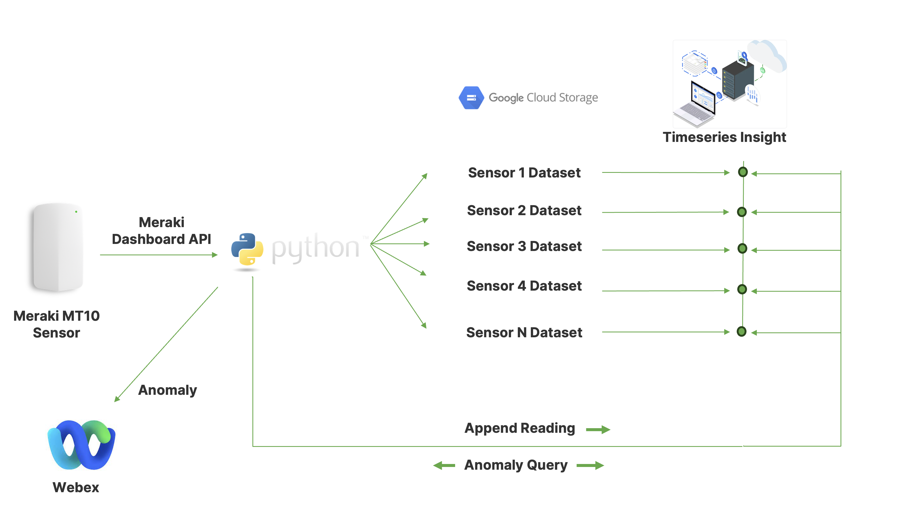

# TimeSeriesInsights

# Descripition
This project uses the Google Cloud Time Series Insights API to provide alerting (via Webex) of anomalous data within temperature measurements from the Meraki MT sensor range, taken from the Meraki Dashboard API. \
 
Meraki's **Dashboard Application Programming Interface** (API) is an interface to interact directly with the Meraki cloud platform and Meraki-managed devices and the data held within. The dashboard API is a modern, RESTful API using HTTPS requests to a URL and JSON as a human-readable format. This project uses the Dashboard APi to extract historic and recent temperature sensor readings. \
 
**Google Timeseries Insights** - creates a timeseries based on an uploaded dataset, against which ML queries can be run in real time providing anomaly detection and forecasting. 

# Usage
The solution is launched using the following command line command:
$python3 anomalyDetection.py

Once this command is issued, the folowing steps are followed:
 
1. User is prompted to provide a timescale (measured in days) of the number of days of historic data that should be used as a basis for anomaly detection
2. The given number of days worth of data is downloaded from the Meraki Platform (this may take several minuted depending ont he quantity of data requested)
3. The raw data is processed into a format required by GCP's Timeseries Insights
4. The processed data is uploaded to Google Cloud Storage
5. The stored data is used to create a dataset withi Timeseries Insights. One dataset is created for each Temperature sensor detected in stage 1)
6. The Meraki Dashboard API is periodically queried for the latest Temperature readings across the range of Temperature Sensors found. This reading is appended to the previously created dataset for that Temperature Sensor
7. The temperature sensor reading is evaluated against the dataset for anomaly. An Anomaly is registered if the lastest reading is 4 standard deviations from the expected reading at that point in time
8. In the event of an anomaly being detected, a message is sent to the Webex Space configured in config.py

# Configuration
The following configuration parameters are required. The config.py file included in this repo cotains dummy credentials for illustration
* KEY  - Meraki Dashboard API key
* ORG  - Meraki Org
* GCP_CredentialFile - Google Credential file in .json
* GCP_storageProject
* GCP_storageProjectFile
* GCP_location
* ANOMALYRATING - Number of Standard Deviations required to indicate an anomaly to be alerted
* WBXRoomID - The room ID to send anomaly alerts
* WBXAuth - Webex Space Authentication Key

# Requirements
Tested using: \
Python v 3.10.12 \
Meraki Dashboard v 1.39 \
Ubuntu 22.04.3 LTS \

# Useful Commands
The following allow for the manual inspection of the status of datasets via the TimeSeriesInsights API:

alias gcurl='curl -H "Authorization: Bearer $(gcloud auth print-access-token --impersonate-service-account=timeseriesserviceacc@,project_id>.iam.gserviceaccount.com)" -H "Content-Type:application/json"' \
PROJECT_ID="project id here" \
\
gcurl -X DELETE https://timeseriesinsights.googleapis.com/v1/projects/${PROJECT_ID}/datasets/**dataset_name** \
gcurl https://timeseriesinsights.googleapis.com/v1/projects/${PROJECT_ID}/datasets \

# Resources
## Timeseries Insights API tutorial
### Part I 
https://medium.com/google-cloud/perform-real-time-anomaly-detection-using-google-clouds-timeseries-insights-api-part-i-f6572021ac0 
### Part II
https://medium.com/google-cloud/perform-real-time-anomaly-detection-using-google-clouds-timeseries-insights-api-part-ii-54520586ad6d 

## Timeseries Insights API Documentation
https://cloud.google.com/timeseries-insights/docs/overview 

# Future Development
The solution may be easily be adapted to provide insights into other datasets from the Meraki Platform - both environmental / sensor data (e.g. humidity, Luminosity, CO2 levels) and network data (e.g. Uplink utilization, numbers of cnnected clients etc)

